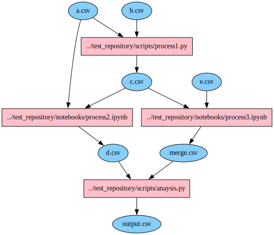
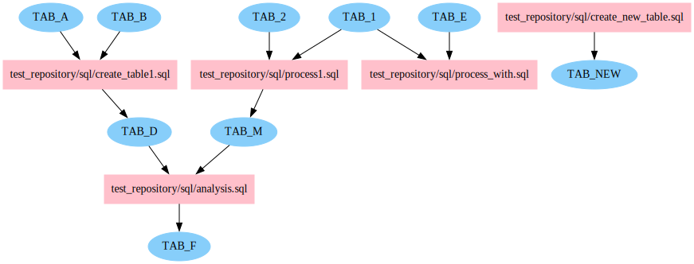
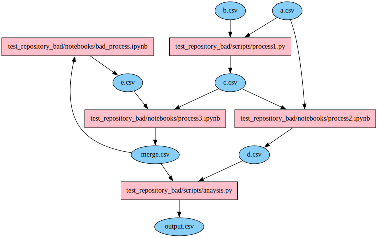

# data processing flow visualizer
Visualize data processing flow written by python scripts or jupyter notebooks and SQL.
For parsing SQL queries, `sql-metadata` are used.

## Supported syntaxes
The default supported syntaxes is below.
You can customize syntaxes by changing `config/data_io_format.json`
- Python
  - Pandas
- SQL
  - MySQL
  - PostgresSQL
  - Sqlite

# Usage
## Bulid data processing graph.
```Python
exe_visualize.py -r repository -s True
```
`Svg` files of visualized graphs are saved in `repository`.

# Automatic detection of ill-defined structure in the graphs

To prevent unexpected data modifications, `exe_visualize.py` shall raise warning when it detected ill-defined graph structures either of the following violations.
- Circular reference of data
- Writing to the same data by multiple scripts

# Exsample





```
WARNING: A cycle as below in python data processing flow graph is detected.
This means there is circular reference of data.
[['merge.csv', 'test_repository_bad/notebooks/bad_process.ipynb', 'e.csv', 'test_repository_bad/notebooks/process3.ipynb']]
```
